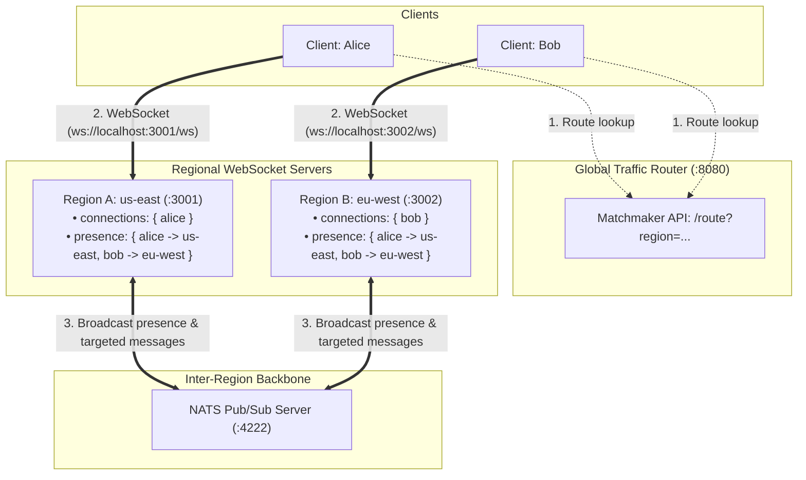
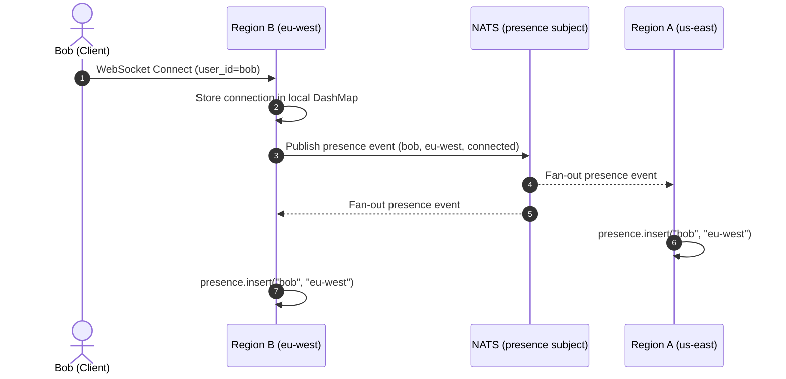
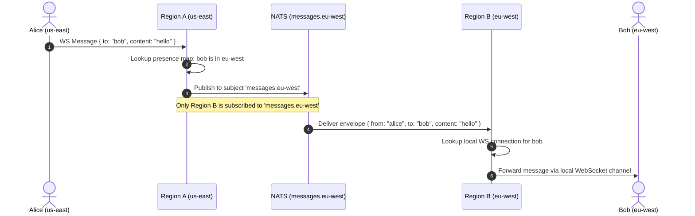

# Regionally Distributed WebSocket Communication System

A WebSocket server system where clients connect to their nearest regional server and communicate seamlessly with clients connected to other regions — built in Rust.

## High-Level Design



### Message Flow

1. Alice sends `{ "to": "bob", "content": "hello" }` to her regional server (us-east).
2. us-east checks its local `connections` map — Bob is not here.
3. us-east checks its local `presence` map — Bob is in eu-west.
4. us-east publishes the message to NATS subject `messages.eu-west`.
5. eu-west's background subscriber receives it and delivers it to Bob's WebSocket channel.


---

## NATS Architecture

NATS is the inter-region messaging backbone. Two subjects are defined, each with a different delivery pattern.

### Subjects

| Subject | Pattern | Publishers | Subscribers |
|---|---|---|---|
| `presence` | **Broadcast** — all regions receive every event | Every regional WS server | Every regional WS server |
| `messages.<region_id>` | **Targeted** — only one region receives it | Any regional WS server | Only the named region |

### `presence` — Broadcast Subject

Every regional server subscribes to `presence` at startup. When a client connects or disconnects from any region, that region publishes a presence event to this subject. NATS fans it out to every subscriber — meaning every region always has a complete picture of who is connected where across the entire network.



Wire type:
```json
{ "user_id": "bob", "region_id": "eu-west", "kind": "connected" }
{ "user_id": "bob", "region_id": "eu-west", "kind": "disconnected" }
```

The presence data lives in each server's in-memory `DashMap`. NATS only delivers the event and forgets it — nothing is stored in NATS.

### `messages.<region_id>` — Targeted Subject

Each regional server subscribes only to its own subject (`messages.us-east`, `messages.eu-west`, etc.). When a server needs to forward a message to a client in another region, it publishes to that region's specific subject. Only the target region receives it.



Wire type:
```json
{ "from": "alice", "to": "bob", "content": "hello" }
```

### Delivery model

Messages are delivered **fire-and-forget** — the publishing server does not wait for acknowledgement. If the recipient disconnects between the NATS publish and delivery, the message is dropped and a warning is logged.

### Adding a new region

A new region only needs to:
1. Subscribe to `presence` — immediately starts receiving connect/disconnect events from all existing regions.
2. Subscribe to `messages.<its-own-region-id>` — starts receiving messages targeted at it.
3. Publish its own presence events — all other regions update their maps automatically.

No configuration changes are needed in existing regions.

## Components

| Service | Port | Description |
|---|---|---|
| `nats` | 4222 | NATS messaging server (inter-region transport) |
| `nats` monitor | 8222 | NATS HTTP monitoring dashboard |
| `region-a` | 3001 | WebSocket server — simulates us-east |
| `region-b` | 3002 | WebSocket server — simulates eu-west |
| `router` | 8080 | Global traffic router — maps region names to WS URLs |

---

## Setup

### Prerequisites

- [Docker](https://docs.docker.com/get-docker/) and [Docker Compose](https://docs.docker.com/compose/)
- [Rust](https://rustup.rs/) (for running the CLI client locally)

### Pull the NATS image

```bash
docker pull nats:2.14.3-alpine
```

### Vendor dependencies (required before first Docker build)

Docker builds run without internet access. All dependencies must be downloaded locally first:

```bash
cargo vendor
```

This downloads every dependency into a `vendor/` folder (not committed to git). The `.cargo/config.toml` file already tells cargo to use it. You only need to run this once, or again after changing `Cargo.toml`.

---

## Starting the System

Build and start all services:

```bash
docker-compose up --build
```

Start in background:

```bash
docker-compose up --build -d
```

Check all services are healthy:

```bash
docker-compose ps
```

View logs for a specific region:

```bash
docker-compose logs -f region-a
docker-compose logs -f region-b
docker-compose logs -f router
```

Open the NATS monitoring dashboard in your browser:

```
http://localhost:8222
```

---

## Running the Clients

The CLI client asks the router which WebSocket server handles the requested region, connects to it, and lets you exchange messages in real time.

Build the client binary:

```bash
cargo build --bin client
```

Open **two separate terminals**:

**Terminal 1 — Alice connecting to us-east:**

```bash
cargo run --bin client -- --user-id=alice --region=us-east --to=bob
```

**Terminal 2 — Bob connecting to eu-west:**

```bash
cargo run --bin client -- --user-id=bob --region=eu-west --to=alice
```

Once both are connected, type a message in either terminal and press Enter. It will appear in the other terminal.

### Client flags

| Flag | Required | Default | Description |
|---|---|---|---|
| `--user-id` | Yes | — | Your user identity on the network |
| `--to` | Yes | — | User ID of the person you want to message |
| `--region` | No | Auto (Lowest Latency) | Explicit override (`us-east` or `eu-west`). If omitted, client probes all regions and picks the lowest RTT |
| `--router` | No | `http://localhost:8080` | URL of the global traffic router |

### Automatic Latency-Based Smart Routing

If you omit `--region`, the client queries the Global Traffic Router (`GET /regions`) for candidate servers, runs a real-time HTTP ping probe against each region, and automatically connects to the server with the lowest round-trip latency:

```bash
cargo run --bin client -- --user-id=alice --to=bob
```

### Same-region test

Both clients can connect to the same region — messages are delivered locally without touching NATS:

```bash
# Terminal 1
cargo run --bin client -- --user-id=alice --region=us-east --to=bob

# Terminal 2
cargo run --bin client -- --user-id=bob --region=us-east --to=alice
```
---

## Stopping the System

```bash
docker-compose down
```
